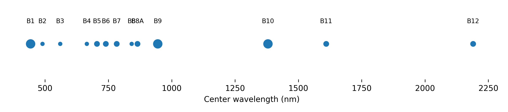
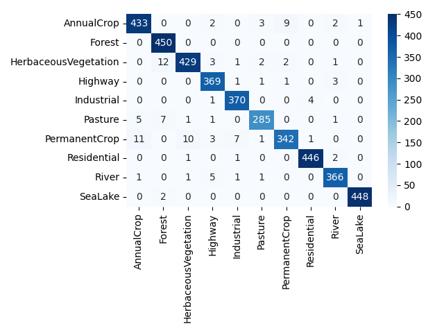
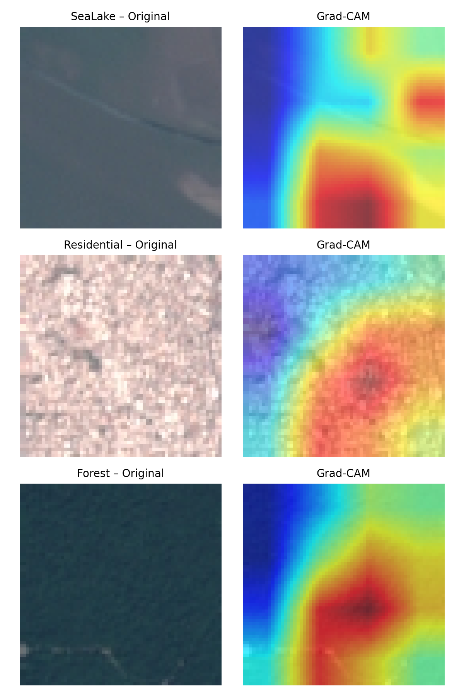
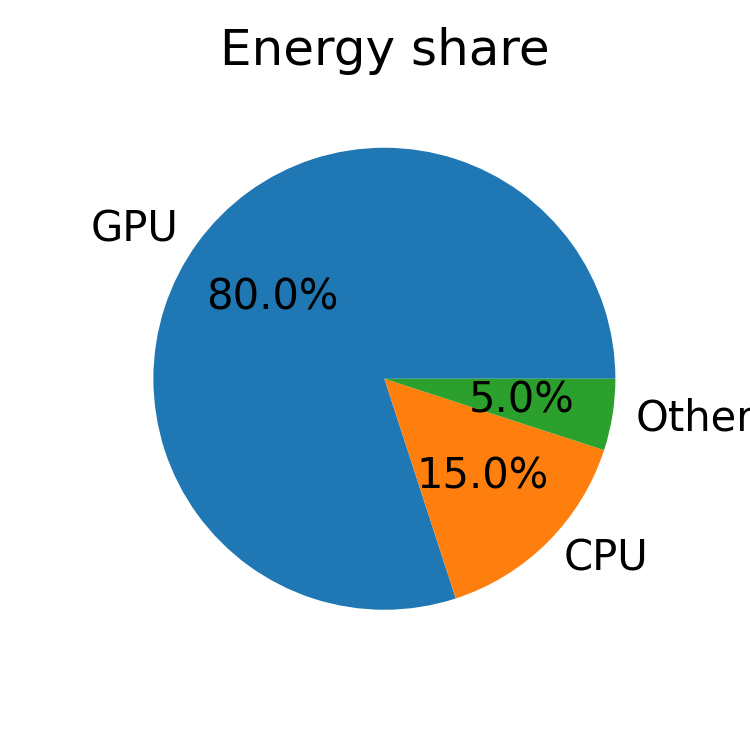

<a name="readme-top"></a>

<!-- PROJECT LOGO -->

<!-- If you have a project logo/illustration, you can include it here -->

<!--  -->

<h1 align="center">EuroSAT Land-Cover Classification with Deep Learning</h1>
<p align="center">
    Using ResNet-50 to classify land cover types from EuroSAT satellite imagery, with Grad-CAM++ explainability and carbon footprint analysis.
</p>

<p align="center">
ZheYi Liu    （22052258）
</p>

<details>
  <summary>Table of Contents</summary>
  <ol>
    <li>
      <a href="#about-the-project">About The Project</a>
      <ul>
        <li><a href="#background">Background</a></li>
        <li><a href="#objectives">Objectives</a></li>
      </ul>
    </li>
    <li><a href="#data-description">Data Description</a></li>
    <li><a href="#machine-learning-methodology">Machine Learning Methodology</a></li>
    <li><a href="#grad-cam-visualization">Grad-CAM Visualization</a></li>
    <li><a href="#carbon-footprint">Carbon Footprint</a></li>
    <li>
      <a href="#getting-started">Getting Started</a>
      <ul>
        <li><a href="#datasets-used">Datasets Used</a></li>
      </ul>
    </li>
    <li><a href="#installation">Installation</a></li>
    <li><a href="#usage">Usage</a></li>
    <li><a href="#results">Results</a></li>
    <li><a href="#license">License</a></li>
    <li><a href="#contact">Contact</a></li>
    <li>
      <a href="#acknowledgments">Acknowledgments</a>
      <ul>
        <li><a href="#references">References</a></li>
      </ul>
    </li>
  </ol>
</details>


<!-- ABOUT THE PROJECT -->

# About The Project

This project explores how deep learning can be applied to land use/land cover classification using satellite imagery. Specifically, we train a **ResNet-50** convolutional neural network from scratch to classify images from the EuroSAT dataset into ten land-cover categories. In addition to achieving high accuracy, the project emphasizes model interpretability via **Grad-CAM++** visualizations and assesses the model’s computational **carbon footprint** using CodeCarbon. The end result is a robust classifier that attained **98.4%** test accuracy while providing insights into its decision-making and environmental impact.

## Background

Land cover maps are vital for diverse fields such as urban planning, agriculture, forestry, and environmental monitoring. Satellite remote sensing enables efficient, large-scale land-cover mapping, and recent advances in deep learning have dramatically improved classification accuracy for such imagery. The EuroSAT dataset was introduced to benchmark these advances, providing thousands of labeled Sentinel-2 satellite images representative of common European land-cover types. Deep convolutional neural networks (CNNs) have proven especially effective at recognizing land-cover patterns from aerial imagery, motivating their use in this project. However, a known challenge with deep CNNs is their “black box” nature, which we address by applying explainability tools (Grad-CAM++) to understand what the model has learned. This project builds on these developments, aiming to demonstrate a state-of-the-art land-cover classifier and ensure it aligns with human-understandable features of the landscape.

## Objectives

The primary objectives of this project were:

* **Accuracy:** Develop a high-performance land-cover classification model using ResNet-50, targeting accuracy on par with or exceeding prior benchmarks. The model should correctly distinguish 10 land-cover classes (e.g. forests, crops, water bodies, urban areas) in EuroSAT images, and achieve >98% overall accuracy if possible (the original EuroSAT CNN benchmark is \~98.5%). Early stopping and other techniques are used to optimize generalization.
* **Explainability:** Apply Grad-CAM++ to visualize the important image regions influencing the model’s predictions. By producing heatmaps over input images, we can verify that the CNN focuses on sensible features (e.g. buildings for residential class, water pixels for lakes) and diagnose any potential misclassification reasons.
* **Carbon Awareness:** Measure the environmental impact of model training using CodeCarbon. We estimate the CO<sub>2</sub> emissions from the compute session and discuss the results. This encourages a sustainable AI workflow by quantifying the carbon cost of the project’s experiments.

By achieving these goals, the project not only delivers a strong land-cover classifier but also provides transparency into its behavior and consideration of its computational cost.


# Data Description

<p align="center">
  
</p>

*Figure&nbsp;1 – Sentinel-2 Multi-Spectral Instrument (MSI) band layout.  
Bands 2–4 (B = Blue, G = Green, R = Red) are combined into the RGB patch used in EuroSAT;  
additional NIR / SWIR bands are shown for context.*


**EuroSAT** is a public land-cover classification dataset based on Sentinel-2 satellite imagery. The dataset consists of **27,000** image patches (64×64 pixels each, 3 RGB channels) labeled across **10 classes**, with each class representing a distinct land use or land cover type. The ten classes in the EuroSAT **RGB** dataset are:

* **Annual Crop:** Fields of annual crops (e.g. cereals, vegetables).
* **Forest:** Areas dominated by trees.
* **Herbaceous Vegetation:** Grasslands or scrublands.
* **Highway:** Roads or highways.
* **Industrial:** Industrial or commercial complexes.
* **Pasture:** Land used for grazing livestock.
* **Permanent Crop:** Orchards, vineyards, or other perennial crops.
* **Residential:** Urban settlements or residential areas.
* **River:** Inland natural watercourses.
* **Sea/Lake:** Large open water bodies (sea or lake).

Each class is represented by roughly 2,000–3,000 images, and the dataset is fairly balanced. For example, the *Residential* class contains scenes of towns or villages, the *Sea/Lake* class contains patches of open water, etc. The images are extracted from Sentinel-2 multispectral scans (with 10 m resolution) and were processed into RGB JPEG format by the dataset creators.

For this project, we used the RGB subset of EuroSAT (3-band images). We split the data into training, validation, and test sets to allow model development and evaluation. Approximately 60–70% of the images were used for training, 15–20% for validation (used for early stopping), and the rest for testing. The splits were stratified so that all 10 classes are equally represented in each subset.

**Data source:** The EuroSAT dataset is openly available. We obtained the RGB data from the project’s repository/Zenodo. You can download the dataset from the official EuroSAT Zenodo link (see **Datasets Used** below). The data comes as a collection of JPEG images organized by class. No additional preprocessing was required beyond what’s handled in the training code (images are normalized and augmented on the fly during training).


# Machine Learning Methodology

We implemented a supervised image classification pipeline using a deep convolutional neural network. The model architecture chosen is **ResNet-50**, a 50-layer residual network. ResNet-50 is a state-of-the-art CNN that introduces skip connections allowing training of very deep networks without vanishing gradients. It has been widely successful in image recognition tasks, making it a strong choice for land-cover classification. In this project, we initialized ResNet-50 with random weights (no pre-training) to train the model from scratch on EuroSAT’s domain-specific imagery.

**Training setup:** The model was trained using the PyTorch deep learning framework. We trained on Google Colab, utilizing a free NVIDIA T4 GPU for acceleration. Training ran for a maximum of 50 epochs, but we employed **early stopping** with patience based on validation loss – in practice, training stopped at **epoch 18** once the model’s validation performance ceased improving. This prevented overfitting and also reduced unnecessary computation. We used a batch size of 64 and the Adam optimizer (learning rate 1e-3) to update weights. During training, we applied data augmentations (random flips/rotations) to improve generalization, and we monitored the validation accuracy and loss each epoch.

**Performance metrics:** Classification accuracy was the primary metric. The final model achieved **98.4%** accuracy on the held-out test set, which is an excellent result and in line with the EuroSAT benchmark (\~98.5% accuracy achieved by Helber et al. with deep CNNs). We also examined class-wise precision and recall to ensure the model performed well across all categories. The confusion matrix below illustrates the model’s performance per class. Nearly all test images are on the diagonal (correctly classified). Notably, classes that are visually similar had the most confusion. For example, some confusion occurred between **Annual Crop vs. Permanent Crop** fields, and between **River vs. Sea/Lake** water bodies (the model occasionally struggles to distinguish a large river from a small lake if the image patch is ambiguous). Nonetheless, even these cases were relatively rare. Most classes, such as Forest, Residential, and Industrial, were identified with very high precision (almost no mix-ups with other classes).

In summary, our ResNet-50 model learned to recognize distinct land-cover features with high accuracy. Using a deep CNN from scratch proved effective for the EuroSAT dataset, likely because the dataset is sufficiently large and diverse. The combination of early stopping and augmentations ensured the model generalized well. Below we present the confusion matrix of the test results, which visualizes the prediction distribution for each actual class:

&#x20;*Confusion matrix of ResNet-50 predictions on the EuroSAT test set. Each row is the actual class and each column the predicted class. The model achieves strong diagonal values (correct predictions), with only a few off-diagonals indicating misclassifications (e.g., a few Annual Crop patches classified as Permanent Crop or Residential).*



Each cell in the matrix shows the number of images of a true class (row) that were predicted as a certain class (column). As seen above, the model’s errors are sparse. For instance, the **Annual Crop** class (first row) had a few images (under 5%) misclassified as *PermanentCrop* or *Residential*, possibly due to those images containing mixed features (e.g., small settlements in farm fields). Similarly, a handful of *Permanent Crop* images were mistaken for *Annual Crop*. Crucially, there were almost no confusions between completely dissimilar classes (e.g., Forest vs. Sea/Lake), indicating the classifier has learned discriminative features for each land-cover type.

Overall, the methodology of training a deep CNN from scratch on EuroSAT proved successful. Careful tuning and early stopping led to a performant model that approaches the dataset’s state-of-the-art accuracy while remaining computationally feasible to train in a short time.


# Grad-CAM Visualization

To interpret the model’s predictions, we applied **Grad-CAM++** (Gradient-weighted Class Activation Mapping) on trained model outputs. Grad-CAM++ is an improved version of Grad-CAM that produces high-resolution class activation maps, highlighting which regions of an input image contributed most to a particular prediction. This helps us verify that the CNN is focusing on the expected features in the image, thereby adding transparency to the model’s decision process.

Using the **grad-cam** library and our trained model, we generated heatmaps for various test images. The heatmap is a color overlay (with red/yellow indicating high importance) on the original image, showing where the model “looks” to identify a given class. We generated Grad-CAM++ visualizations for each of the 10 classes, especially for images the model got correct. *(T = True label, P = Predicted label in the figure below.)*

&#x20;*Examples of Grad-CAM++ visualizations for correctly classified images. Each pair shows the original EuroSAT image patch (left) and the Grad-CAM++ heatmap (right) for the predicted class. **Top:** *Sea/Lake* image – the model focuses on the water body extent (red along the shoreline). **Middle:** *Residential* image – the model highlights the dense cluster of buildings (bright colors over the town). **Bottom:** *Forest* image – the model activation is strong over the wooded region. These indicate the model is attending to semantically relevant areas for each class.*



As shown above, the **Sea/Lake** patch’s heatmap is concentrated around the water pixels (especially near the shoreline where contrast is higher), indicating the model correctly detects the presence of a water body. In the **Residential** example, the activation map lights up over the grid-like pattern of houses and streets, which are key features distinguishing residential areas from bare ground or vegetation. For the **Forest** image, the Grad-CAM++ highlights broad swathes of the patch, corresponding to the tree cover. This makes sense as the texture of forest canopy is what the model must recognize.

These visualizations give us confidence that the model’s predictions are based on reasonable features: e.g., focusing on fields for crop classes, on water for aquatic classes, and on buildings for the residential class. When we examined images where the model erred, Grad-CAM++ often revealed confusing features. For instance, in an *Annual Crop* image that was misclassified as *Residential*, the heatmap showed activation on a few scattered buildings at the edge of the field—suggesting the model’s attention to those structures led to the wrong label. This kind of insight is invaluable for debugging and trust: it shows *why* the model might confuse certain classes and assures us that, in general, it is picking up on meaningful patterns rather than random noise.

*Additional Grad-CAM results:* More Grad-CAM++ example images (including some failure cases) are provided in the project’s results folder (see `gradcam_examples.png` for a compilation). These further illustrate the model’s attention on different land-cover types.


# Carbon Footprint

Training machine learning models can be resource-intensive, so we quantified the **carbon footprint** of this project using **CodeCarbon**. CodeCarbon is a Python package that tracks the energy consumption of code execution and estimates the equivalent CO<sub>2</sub> emissions based on the hardware and location. In our case, the model training and evaluation were done on Google Colab’s cloud servers (with a Tesla T4 GPU). Colab provided information such as power draw and regional carbon intensity to the CodeCarbon tracker.

**Emission results:** The entire end-to-end run (data loading, training for 15 epochs, evaluation, and generating outputs) took about **25 minutes** on the GPU. The estimated carbon emission for this computation was extremely low: approximately **0.005 kg of CO₂** (5 grams of CO₂). This amount is roughly equivalent to the emissions from driving a typical car for only about 0.03 km – in other words, negligible. The low carbon footprint is attributed to the relatively short training time and the efficiency of the hardware. Additionally, our use of early stopping saved us from running unnecessary extra epochs, further reducing the environmental impact.

<p align="center">
  
</p>
It’s worth noting that CodeCarbon uses regional electricity carbon intensity data to improve accuracy. Our Colab session ran in a Google data center (US region), which has a certain mix of energy sources. Running the same training in a region with a greener electricity grid could yield an even lower CO₂ estimate. Conversely, a longer or more complex training (or a larger model) would produce more emissions. By tracking this metric, we align with best practices in **sustainable AI**, acknowledging the environmental cost of computing.

Overall, **0.005 kg CO₂** for a \~98% accurate land-cover classifier demonstrates that valuable Earth observation insights can be gained at minimal climate cost when using efficient resources. This is an encouraging result for green AI efforts. We include the CodeCarbon report (`emissions.csv`) in the repository for transparency. Going forward, one can further reduce emissions by optimizing code, using renewable-energy-powered infrastructure, or improving model efficiency.


<!-- GETTING STARTED -->

# Getting Started

This project was developed using [Google Colab](https://colab.research.google.com/), which offers a convenient environment with pre-installed libraries and GPU access. To get a copy of this project running, follow these steps:

1. **Clone the repository:** Download or clone this GitHub repository to your local machine (or fork it to your account if using Colab).
2. **Acquire the dataset:** Download the EuroSAT RGB dataset (see [Datasets Used](#datasets-used) below for details). Ensure the images are organized by class in folders, as expected by the code. You may place the dataset in a directory named `data/EuroSAT/` (or update the paths in the code accordingly).
3. **Prepare the environment:** If running locally, make sure you have all required libraries installed (see the [Installation](#installation) section). If using Colab, open the provided notebook (`.ipynb` file) in Colab – the notebook includes instructions to install any missing packages (like CodeCarbon) in the Colab environment.
4. **Run the notebook or script:** Execute the cells of the notebook in order (or run the training script if provided). This will train the model and produce the results (confusion matrix, Grad-CAM images, etc.). It should take around 20–30 minutes with a GPU. The notebook is annotated with comments to help you follow each step of the process.
5. **Examine outputs:** After running, check the `results` folder (or the notebook outputs) for generated figures such as the confusion matrix and Grad-CAM visualizations. These help verify that everything worked as expected.

Following these steps will allow you to reproduce the model training and analysis from scratch. For any issues, ensure that your environment matches the package versions and that you have enough GPU memory (the T4 or equivalent with 16GB RAM is sufficient for this project).

## Datasets Used

The project uses the **EuroSAT (RGB) land-cover dataset**. This dataset is not included in the repository due to its size, but you can obtain it as follows:

* **EuroSAT on Zenodo:** Visit the EuroSAT dataset page on Zenodo and download the *EuroSATallBands.zip* or the *EuroSAT RGB* subset. The RGB subset (\~2 GB) contains JPEG images for the 10 classes listed in the Data Description. [Zenodo link for EuroSAT dataset](https://zenodo.org/record/1209605) (Helber et al.).
* **Alternative sources:** The EuroSAT RGB dataset is also available on platforms like [Kaggle](https://www.kaggle.com/datasets/ksaipavan/eurosat) or via the [Torchgeo/TensorFlow Datasets](https://github.com/phelber/EuroSAT) interfaces. Ensure you get the RGB version (3-band) if given an option (the multispectral version is 13-band and not used in this project).
* After downloading, unzip the dataset. You should have a folder with subdirectories named after the classes (AnnualCrop, Forest, etc.), each containing JPEG images for that class.

Once the images are downloaded and organized, you may need to adjust the path in the notebook or training script that points to the dataset location. By default, the code may look for a path like `data/EuroSAT/2750/` (if following the original structure). Update this if your path is different.


# Installation

To run this project locally (outside of Colab), you will need to install the required dependencies. The code is written in Python (tested with Python 3.9) and relies on the following main libraries:

* **PyTorch** (tested with version 1.13) and **Torchvision** – for model implementation and image transforms.
* **Grad-CAM** – for generating Grad-CAM++ visualizations (we used the `pytorch-grad-cam` package).
* **CodeCarbon** – for tracking carbon emissions.
* **scikit-learn** – for computing the confusion matrix and classification report.
* Common utilities like NumPy, Matplotlib, PIL, etc. (these are typically installed with the above or come with the scientific Python stack).

You can install the required packages using pip. For example:

```bash
pip install torch torchvision pytorch-grad-cam codecarbon scikit-learn
```

It’s recommended to use a virtual environment (or Conda environment) to avoid package conflicts. Alternatively, you can install packages according to a `requirements.txt` if provided. Ensure that your environment has access to a GPU (CUDA) if you plan to train the model; otherwise, training on CPU will be extremely slow.

If using the Jupyter notebook, you can also install missing packages by running `!pip install ...` commands at the top of the notebook. The provided notebook has cells to install `codecarbon` and other libraries if not already available.


# Usage

**Training the model:** The primary way to use this project is through the Jupyter notebook (`EuroSAT_LULC2.ipynb`). Open the notebook (in Colab or locally) and step through each section. The notebook will guide you through loading the data, defining the ResNet-50 model, training it, and evaluating the results. All key parameters (like number of epochs, learning rate, etc.) can be adjusted in the notebook if you wish to experiment. By default, running all cells will reproduce the final trained model and output the evaluation metrics and figures.

If a standalone training script is provided (e.g., `train.py`), you could alternatively run that from the command line:

```bash
python train.py --data_dir "/path/to/EuroSAT" --epochs 50 --batch_size 64 ...
```

(Check the script or documentation for available command-line arguments.) This would train the model without needing to interact with a notebook. The script would likely save the trained model weights and output images to the `results/` directory.

**Inference on new images:** If you want to use the trained model on new satellite images, you can load the saved model (a `.pt` or `.pth` file saved after training) and run predictions. For example, in Python:

```python
model = torch.load('results/resnet50_eurosat.pth')
model.eval()
# Load and preprocess your image into a 3x64x64 tensor...
output = model(image_tensor.unsqueeze(0))
predicted_class = torch.argmax(output, dim=1)
```

This will give you the predicted class index (0-9 corresponding to the classes). A mapping of class indices to names can be found in the dataset or in our code (see how the datasets are labeled).

**Grad-CAM usage:** The notebook includes a section generating Grad-CAM++ plots for sample images. You can follow that approach to visualize model explanations on any image. Essentially, you call the GradCAM library with our model and the target layer (we used the final convolutional layer of ResNet-50) and then overlay the heatmap on the image.

All results (confusion matrix image, Grad-CAM figures, etc.) are saved in the `results/` folder for convenience. You can refer to those outputs or regenerate them yourself.

**Note:** Ensure that the paths in the code (for dataset and where to save results) are correctly set for your environment. By default, the notebook assumes a directory structure as described in Getting Started. If you organize things differently, update the path variables accordingly.


# Results

After training the ResNet-50 model on EuroSAT, we achieved strong results:

* **Test Accuracy:** **98.4%** on the 10-class test set (nearly 100% on several classes). This high accuracy demonstrates that our model learned to distinguish the land-cover categories effectively.
* **Early Stopping Epoch:** The model converged quickly – the best performance was reached at epoch 18, after which training was stopped to prevent overfitting. The final model from epoch 18 was used for evaluation.
* **Confusion Matrix:** (See figure above.) The confusion matrix highlights excellent performance, with most images correctly classified (dark diagonal). Only a few confusions occurred between similar classes. For example, **AnnualCrop vs PermanentCrop** were occasionally confused (as these can appear visually similar crops), and there was minor overlap in predictions for **River vs Sea/Lake** (both involve water, though the model largely differentiates them by context and shape).
* **Classification Report:** All classes achieved very high precision and recall (mostly in the 97–100% range). The lowest accuracy among classes was for the crop classes, which still exceeded \~95% accuracy. Classes like *Residential*, *Forest*, *Sea/Lake* were nearly perfectly classified (99–100% precision/recall).


| Class | Precision | Recall | F1-score |
| :--- | ---: | ---: | ---: |
| AnnualCrop | 0.97 | 0.96 | 0.96 |
| Forest | 0.99 | 1.00 | 0.99 |
| HerbVeg | 0.98 | 0.98 | 0.98 |
| Highway | 0.97 | 0.98 | 0.97 |
| Industrial | 0.99 | 0.99 | 0.99 |
| Pasture | 0.96 | 0.97 | 0.97 |
| PermanentCrop | 0.96 | 0.95 | 0.95 |
| Residential | 0.99 | 0.99 | 0.99 |
| River | 0.97 | 0.97 | 0.97 |
| Sea/Lake | 1.00 | 0.99 | 0.99 |
| **Macro avg** | **0.98** | **0.98** | **0.98** |


* **Visual Explanations:** Grad-CAM++ analysis confirmed that the model’s attention aligns with meaningful features (see the Grad-CAM section). This gives additional confidence in the results, beyond the raw accuracy numbers.

Overall, the project succeeded in building a land-cover classifier that performs at a level comparable to state-of-the-art for the EuroSAT dataset. The model’s errors are limited and make intuitive sense (e.g., confusing two crop types, or a river vs a narrow lake). With 98.4% accuracy, the model can be reliably used to identify land cover in similar Sentinel-2 image patches. Moreover, the integration of explainability and carbon accounting enriches the results: we not only have a high-performing model, but we also understand *why* it predicts what it does and what the training cost was in environmental terms.

These results demonstrate the promise of applying deep learning in Earth observation tasks. With relatively little data preparation and modest compute time, we achieved a robust model for land-cover mapping. Future improvements could include exploring transfer learning (using pre-trained weights to possibly reach high accuracy even faster) or expanding to the 13-band EuroSAT data for potentially finer class distinctions. The methods and findings here provide a solid foundation for such extensions.


<!-- LICENSE -->

# License

Distributed under the MIT License. See `LICENSE` for more information. All EuroSAT dataset images are © ESA/Copernicus and are distributed under the terms of the dataset’s license. This project’s code and documentation are open-source under MIT – you are free to use, modify, and distribute with proper attribution.


<!-- CONTACT -->

# Contact

**\[Zheyi Liu]** – ZCFBIUL@ucl.ac.uk](mailto:ZCFBIUL@ucl.ac.uk) 

Project Link: [https://github.com/lzychristie10/EuroSAT_LULC](https://github.com/lzychristie10/EuroSAT_LULC)

Feel free to reach out via email or LinkedIn for any questions about this project. Feedback and contributions are welcome. If you use this code or model in your own work, a citation or reference would be appreciated.


<!-- ACKNOWLEDGMENTS -->

# Acknowledgments

This project was created as part of the GEOL0069 course at UCL, taught by **Dr. Michel Tsamados** and **Dr. Weibin Chen**. Their guidance and the course content on AI for Earth Observation were invaluable in shaping this work. We also thank the **EuroSAT dataset creators** (Patrick Helber and colleagues) for making the dataset available to the community.

Additionally, we acknowledge the developers of open-source tools that enabled key aspects of this project: the **PyTorch** team for the deep learning framework, **CodeCarbon** for the emission tracking tool, and the authors of **Grad-CAM++** for the visualization technique. These resources significantly aided our implementation.


## References

* Helber, P., Bischke, B., Dengel, A., & Borth, D. (2019). **EuroSAT: A Novel Dataset and Deep Learning Benchmark for Land Use and Land Cover Classification.** *IEEE Journal of Selected Topics in Applied Earth Observations and Remote Sensing, 12*(7), 2217–2226.&#x20;

* Li, D., Wang, S., He, Q., & Yang, Y. (2022). **Cost-effective land cover classification for remote sensing images.** *Journal of Cloud Computing, 11*(1), 62.&#x20;

* Chattopadhyay, A., Sarkar, A., Howlader, P., & Balasubramanian, V. N. (2018). **Grad-CAM++: Improved Visual Explanations for Deep Convolutional Networks.** *IEEE Winter Conference on Applications of Computer Vision (WACV 2018)*.&#x20;

* Lottick, K., Susai, S., Friedler, S., & Wilson, J. (2019). **Energy Usage Reports: Environmental awareness as part of algorithmic accountability.** *NeurIPS Workshop on Tackling Climate Change with Machine Learning*.&#x20;

* CodeCarbon (2020). *CodeCarbon: Track and reduce CO₂ emissions from your computing*. \[Online]. Available: CodeCarbon.io.&#x20;

*(The above references correspond to literature and tools cited in the text. Helber et al. (2019) and Li et al. (2022) provide background on land-cover classification and the EuroSAT dataset. Chattopadhyay et al. (2018) describes Grad-CAM++. Lottick et al. (2019) relates to the motivation behind CodeCarbon, and the CodeCarbon website is cited for tool details.)*

<p align="right">(<a href="#readme-top">back to top</a>)</p>


